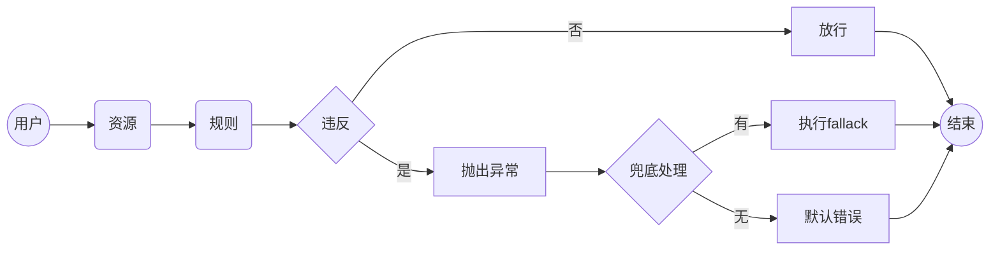

# Sentinel

## 定义资源
- 主流框架中的 Web 接口均为资源
- 编程式：SphU API
- 声明式：@SentinelResource
  
## 定义规则
- 流量控制 FlowRule
- 熔断降级 DegradeRule
- 系统保护 SystemRule
- 来源访问控制 AuthorityRule
- 热点参数 ParamFlowRule

## 工作流程

## 流控规则
- 阈值类型
- 流控模式
  - 直接
  - 链路
  - 关联
    - eg: 读写优先控制
- 流控效果
  - 快速失败
    - 仅此支持**流控模式**设置
    - 多余丢弃
  - Warm Up
    - 预热/冷启动
    - 关键参数：预热时长
  - 排队等待
    - 1s 内均摊，故不支持 QPS > 1000
    - 多余排队，排队时长达到 timeout 会丢弃
    - 关键参数：timeout
    - 扩展知识：Leaky Bucket 算法、虚拟队列等待机制

## 熔断规则
- alias（熔断降级）
- 优点
  - 切断不稳定调用
  - 快速返回不积压
  - 避免雪崩效应
- 通常在调用端进行配置（作为自我保护）
- 断路器
  - 关键参数：统计时长、最小请求数
  - 闭合
    - 慢调用比例
    - 异常比例
    - 异常数
  - 打开
    - timeWindow(熔断时长)
  - 半开
    - 放行一个探测

## 热点规则
- 更细粒度的流控，参数级别 