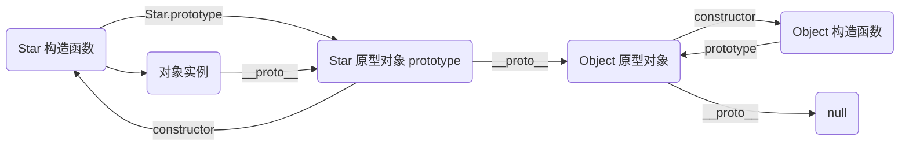

# 构造函数和原型

**ES6 之前创建函数三种方式**
```javascript
// 对象字面量
var obj = {}

// new Object()
var obj2 = new Object()

// 自定义构造函数
function Star(uname, age) {
    this.uname = uname
    this.age = age
    this.sing = function() {
        console.log('我会唱歌');
    }
}
var troye = new Star('Troye', 18)
// 实例成员：构造函数内进行赋值的成员
// 静态成员：在构造函数本身上添加的成员（不能通过对象访问）
Star.sex = 'male'
```

## 原型 prototype
> 构造函数存在 **浪费内存** 的问题
> 通过原型分配的函数是所有对象 **共享** 的
> 每个构造函数都有一个原型对象

```javascript

Star.prototype.sing = function() {}

// 每个对象都有一个属性 __proto__ 指向原型对象
console.log(Star.__proto__)

```

## 原型 constructor 构造函数

```javascript
// 如果我们修改了原来的原型对象，给原型对象赋值的是一个对象
// 则必须手动的利用 constructor
Star.prototype = {
    constructor: Star,
    sing: function() {
        console.log('我会唱歌');
    },
    move: function() {
        console.log('我会移动');
    }
}
```

## 原型链


> 对象成员查找规则：就近原则（原型链）


## 继承
> ES6 之前通过 **构造函数 + 原型对象** 模拟继承，也称组合继承

### call
> 调用这个函数可以修改运行时 this 的指向

```javascript
fun.call(thisArg, arg1, arg2, ...)
```
- thisArg：当前调用函数 this 的指向对象
- arg1, arg2：传递的其他参数


### 继承属性和方法
```javascript
function Father(uname, age) {
    // this 指向父构造函数的对象实例
    this.uname = uname
    this.age = age
}

Father.prototype = function money() {
    console.log('赚钱');
}

function Son(uname, age) {
    // this 指向子构造函数的对象实例
    // 继承属性
    Father.call(this, uname, age)
}

// 继承方法
Son.prototype = new Father()
 
```

## ES5 新增方法

### 数组方法

- 迭代方法：forEach(), map(), filter(), some(), every()
```javascript
array.foreach(function(currentValue, index, arr)) // 遍历
array.filter(function(currentValue, index, arr)) // 筛选
array.some(function(currentValue, index, arr)) // 条件查询
```

### 字符串方法
```javascript
str.trim()
```

### 对象方法
- 定义对象中新属性或修改原有属性
```javascript
Object.defineProperty(obj, prop, desciptor)
```